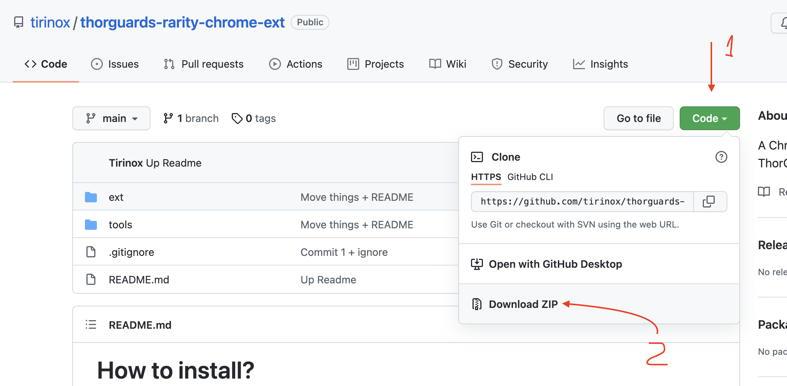
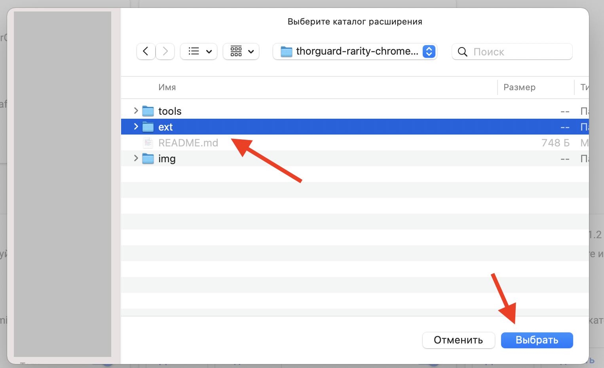
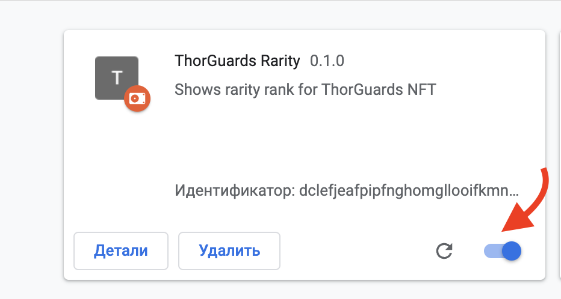
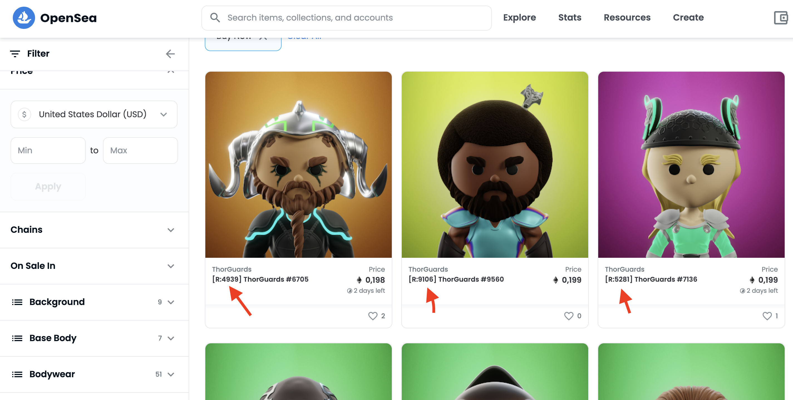

# How to install?

0. Download and unzip this project
1. Open Chrome browser (or compatible)

2. Navigate to [chrome://extensions/](chrome://extensions/)
3. Turn on "Developer mode"
4. Click "Load packed extension"

5. Locate the `ext` folder inside the project.

6. Make sure that "ThorGuards Rarity 0.1.0" extension is there and on.

7. **Go to https://opensea.io/collection/thorguards and enjoy!**
   

## How do you calculate rarity?

1. Calculate logarithms of probability of each trait: `log(n_occ / 10000)`
2. Calculate product those numbers for all traits
3. Sort them in ascending order
4. Rank the list
